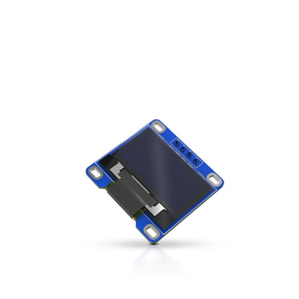

.. _rakwireless_rak1921:

RAK1921 WisBlock OLED Display Module
####################################

Overview
********

RAK1921 is a WisBlock module carrying a Solomon Systech SSD1306 monochrome OLED display
of 128x64 pixels. It communicates over I2C at address 0x3C and needs no other signal, so
it mounts on the dedicated I2C header a WisBlock Base Board carries rather than on a
Sensor Slot.

   RAK1921 WisBlock OLED Display Module (Credit: RAKwireless)

More information about the module can be found at `RAK1921 WisBlock OLED Display
Module`_.

Requirements
************

RAK1921 requires a WisBlock Base Board and a WisBlock Core module. The base board supplies
the I2C node this shield attaches to, so its shield must be listed first.

Programming
***********

List the base board shield before this one so the I2C node exists:

.. zephyr-app-commands::
   :zephyr-app: samples/drivers/display
   :board: rak4631/nrf52840
   :shield: rakwireless_rak19007,rakwireless_rak1921
   :goals: build flash

References
**********

.. target-notes::

.. _RAK1921 WisBlock OLED Display Module:
   https://docs.rakwireless.com/product-categories/wisblock/rak1921
